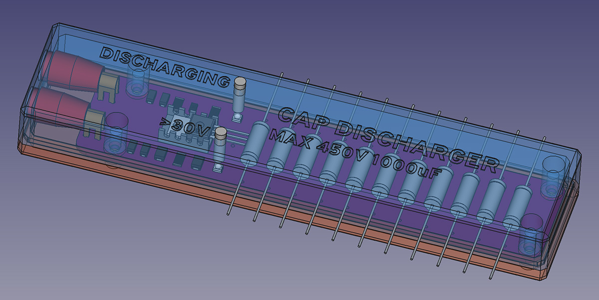
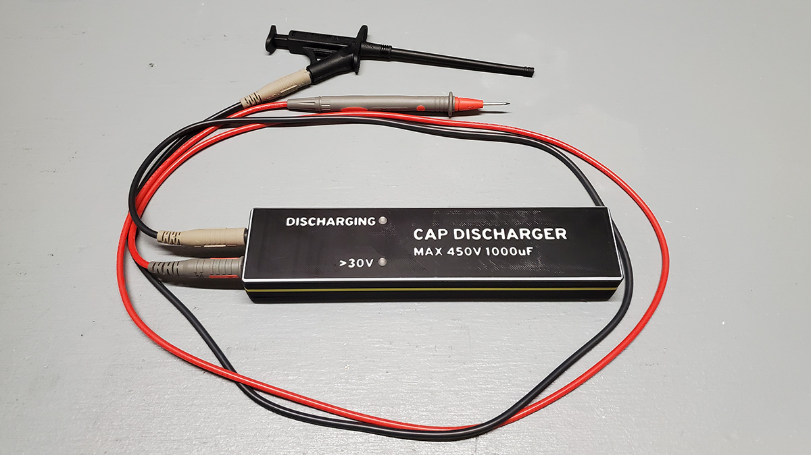
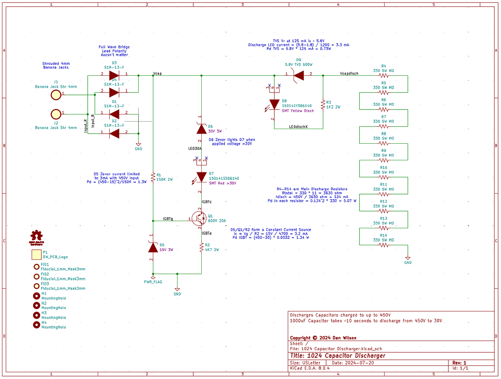
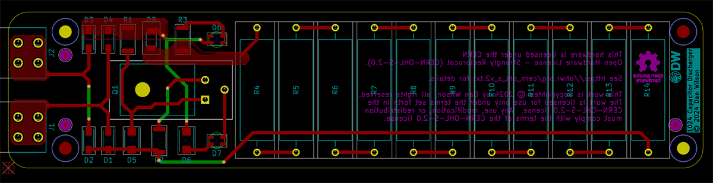
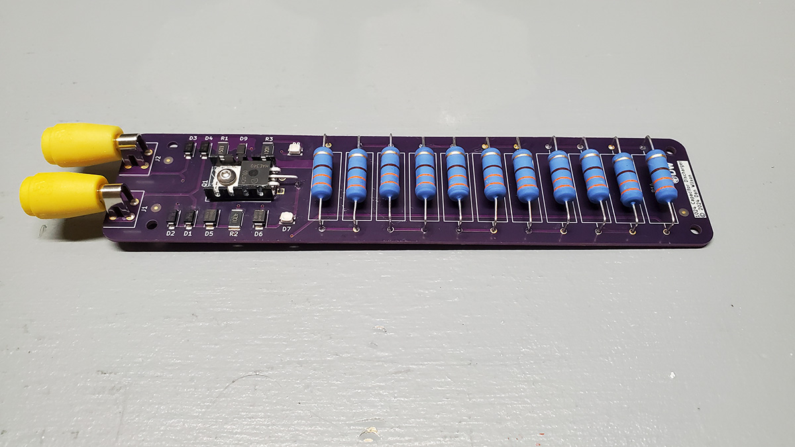

# Capacitor Discharger

This project is a passive (unpowered) capacitor discharger that can safely discharge capacitors up to 450V and 1000 uF.  It assists the operator in quickly discharging the capacitor and providing visual feedback of the discharging process and its completion.

## Overview

The capacitor discharger is a handheld unit with 2 LEDs for indication, and two standard shrouded test lead ports on one end.  It's purpose is to allow safe discharge of a capacitor that is in-circuit prior to working on that circuit.  Capacitors can hold a charge, sometimes for a long period of time, and in some circuits the amount of energy they can hold is dangerous, even potentially lethal.

This unit allows the operator to touch two test leads to the capacitor terminals, and the unit will allow the capacitor to discharge at a constant rate of 125 mA.  This is sufficient current to discharge the largest capacitor that is recommended to be discharged with this unit (a capacitor rated up to 450V, and up to 1000 uF of capacitance) within about 15 seconds.

## Principle of Operation

The unit is a passive device, i.e. it is not powered and no batteries or power source is needed.  The energy in the capacitor is used to light the indicator LEDs during the discharge.

A fixed resistance bank is used to allow the capacitor to discharge at a constant current of 125 mA.  The capacitor's energy is dumped into 11 resistors rated at 5W each.

One LED (yellow) lights as the capacitor is discharging.  This LED will remain lit until the capacitor has no more energy (usually when it's voltage is less than 2V).

The other LED (red) lights if the capacitor voltage is above 30V.  This LED will extinguish when the capacitor has discharged to less than 30V, indicating that the capacitor would be safe to touch.  An IGBT transistor is used in a specific configuration to drive the >30V LED.

## Instructions for Use

Attach two test leads to the 4mm jacks on the end of the unit.  The unit does not have a polarity restriction, and can discharge capacitors in both orientations.  It is recommended that your test leads are of a type that are rated for at least the working voltage of the capacitor you intend to discharge.  If the voltage is greater than 50V, it is recommended to use high voltage test leads with a category rating of at least CAT I / 600V.

For voltages greater than 50V, use appropriate personal protective equipment (PPE), including electrical safety gloves and safety glasses.

With appropriate personal safety equipment in place, touch the test leads to the capacitor leads in either orientation.  The unit will begin discharging the capacitor, and you will see the yellow discharging LED light up.  The red >30V LED will also light if the capacitor voltage is currently greater than 30V.

Keep the test leads connected to the capacitor until the >30V LED light extinguished.  Once the >30V LED light is extinguished, the capacitor is safe to work with.  If the work requires as close to zero charge in the capacitor as possible, continue holding the test leads connected to the capacitor until the discharge LED light is dim or extinguished.

## Assembly

Gerber files are available in the [1024 Capacitor Discharger](KiCAD%20Project%20-%20Discharger/Fabrication%20Exports/1024%20Capacitor%20Discharger.zip) folder.  The [1024 Capacitor Discharger](KiCAD%20Project%20-%20Discharger/Fabrication%20Exports/1024%20Capacitor%20Discharger.zip) file is a pre-compressed archive that is ready to upload to Oshpark.

All parts needed are listed in the [BOM](KiCAD%20Project%20-%20Discharger/BOM/BOM%201024%20Capacitor%20Discharger.csv) CSV file.

If you want to use a solder stencil for reflow of the SMD components, Osh Stencils can produce this stencil from the [1024 Capacitor Discharger-F_Paste](KiCAD%20Project%20-%20Discharger/Fabrication%20Exports/1024%20Capacitor%20Discharger-F_Paste.gbr) Gerber file.  Select a Stainless Steel 4 mil stencil with a border size of 0.75 inches.  The Solder Stencil Jig is designed to fit this stencil.

Use the [SSJv2 1024 Capacitor Discharger](FreeCAD%20Project/Solder%20Stencil%20Jig%20V2/SSJv2%201024%20Capacitor%20Discharger.stl) file to print the solder stencil jig.  A .3mf file is included if you use PrusaSlicer.  Otherwise use the .stl file with the following settings:

- 0.2 mm layer height
- 3 perimeters
- 4 solid layers on bottom
- 5 solid layers on top
- 20% infill
- No supports required

Solder the SMD components onto the PCB using the stencil + solder paste + reflow, or hand solder them.

Solder the THT components onto the PCB by hand.  Be careful when bending the IGBT legs, they need to be accurate because the hole in the TO-220 case must align with the heat sink and the hole in the PCB.  It is recommended to solder the 4mm PCB-mount Banana jacks while the board is fitted into the case top.  This will ensure that the Banana jacks are perfectly aligned and will not impede the fitting of the PCB in the case.

There is a [ResistorBender](FreeCAD%20Project/1024%20Capacitor%20Discharger%20Case/ResistorBender.stl) file in the 1024 Capacitor Discharge Case directory, this can be optionally printed to properly and uniformly bend the resistor legs to fit the PCB.

When assembling the IGBT heat sink, the stackup should be (from the top down):

- M3x8 button-head screw
- Screw insulator
- TO-220 IGBT
- Thermal grease/compound
- Mica insulator sheet from the TO-220 mounting kit listed in the BOM
- Thermal grease/compound
- Aluminum heat sink
- PCB
- (Back of PCB) Flat Washer
- (Back of PCB) M3 hex nut

The screw that is supplied with the TO-220 mounting kit is too long to fit properly in the printed case.  Replace this screw and nut with a button head M3x8 screw, and use the flat washer and an M3 hex nut on the back of the PCB.  Do not use the lock washer.  This should clear the printed case when assembled.

The Mica insulator sheet may be slightly too large to fit inside the aluminum heat sink.  It can be trimmed with scissors.

Use the [CaseBottom](FreeCAD%20Project/1024%20Capacitor%20Discharger%20Case/CaseBottom.stl) and [CaseTop](FreeCAD%20Project/1024%20Capacitor%20Discharger%20Case/CaseTop.stl) files to print the case, using the same settings as the solder stencil jig.  Use a soldering iron to insert 4 Heat-Set Inserts into the case top.  The Heat-Set Inserts should be an M3 x 6mm size.  The screws used to assembly the case should be an M3x12 with a hex cap head.

Assemble the case halves together with the PCB inside, and insert the 4 hex cap M3x12 screws and tighten.

## License

This project is licensed under two restrictive licenses:

The hardware design is licensed under the CERN Open Hardware Licence Version 2 - Strongly Reciprocal.

The documentation, images, and instructions are licensed under the Creative Commons Attribution-ShareAlike 4.0 International Public License.

As stated by the licenses, all uses of this project require attribution and require open-source release under the same licenses.

